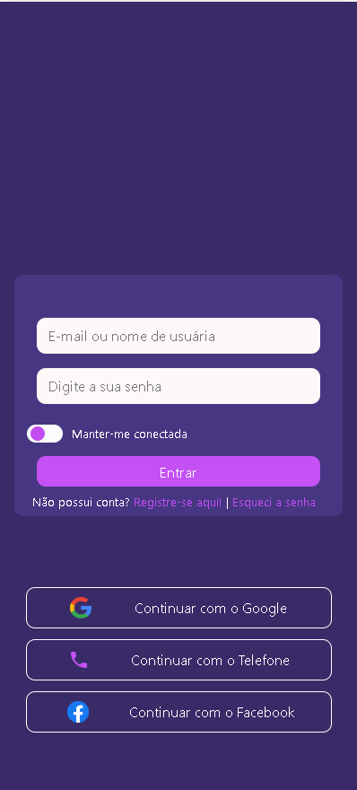
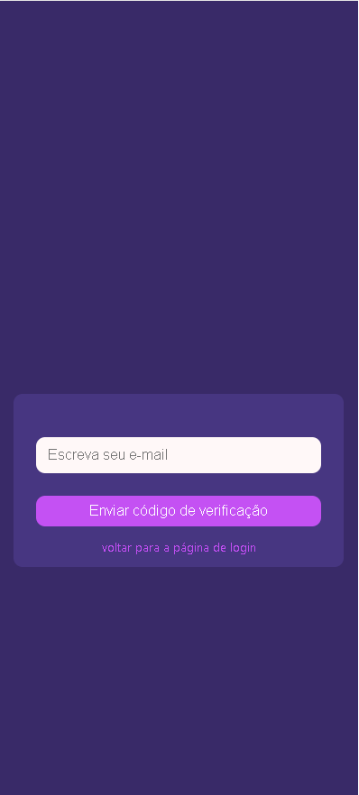
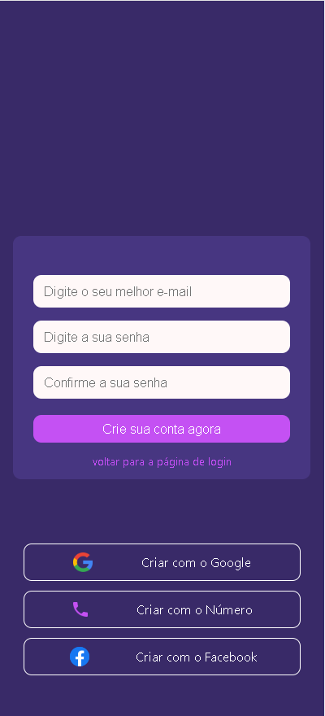
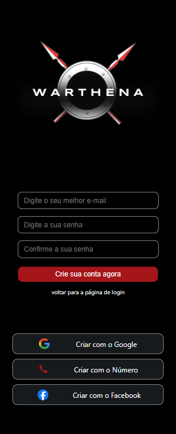
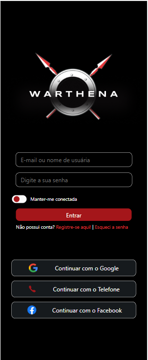
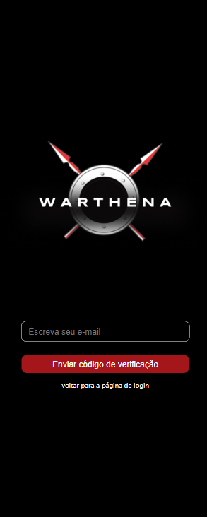

autor: [Hylan Silva](https://github.com/hylansilva) 
Coautora: [Andressa Mota](https://github.com/andressamotaz)  
data de crição: 07/11/2022 
data de ultima alteração: 23/11/2022 
[Site oficial da plataforma](https://warthena.vercel.app)
# Documentação Warthena Project

Aqui estamos usando HTML5, CSS3 e Js. O projeto é fazer o MVP viavel.

## Índice 
- [Inicio do Projeto](#índice)
    - [Como ta organizado as pastas e os arquivos:](#como-ta-organizado-as-pastas-e-os-arquivos)
      - [index.css](#indexcss)
      - [reset.css](#resetcss)
      - [images.css](#imagescss)
      - [fonts.css](#fontscss)
      - [index.css](#indexcss)
  - [Atualização 0.0.6 pré alpha](#atualização-006-pré-alpha)
    - [pasta pages](#pasta-pages)
    - [ pasta assets dentro de pages](#pasta-assets-dentro-de-pages)
      - [chat.html](#chathtml)
      - [chatmesseger.html](#chatmessegerhtml)
      - [feed.html](#feedhtml)
      - [forgotpassword.html](#forgotpasswordhtml)
      - [register.html](#registerhtml)
    - [autores](#autores)

## Como ta organizado as pastas e os arquivos:

eu (Hylan Silva) organizei quase todo o projeto dentro da página de assets, o que deixa mais simples e organizado. o arquivo principal e a página main é o [index.html](index.html)  nele está a página principal que é a página de log-in. 

a parte de Css foi divida em alguns arquivos dentro de uma pasta [Css](./assets/css/) que podem ser bastante importantes no futuro. que no caso são: 
    

### index.css
[index.css](./assets/css/index.css) 
É a parte principal da aplicação, onde o css que normalmente vai ser o criado para harmonizar o projeto,  

 

### reset.css
[reset.css](./assets/css/reset.css) 
A técnica do reset css é uma forma de suavizar estas diferenças e padronizar a estilização, sobrepondo a formatação original do browsers com uma folha de estilo. Assim, o reset css se tornou um arquivo quase que obrigatório em cada projeto web.

### images.css
[images.css](./assets/css/images.css) 
Neste arquivo aqui vamos estilizar e formatar tudo que é css relacionado as imagens do nosso projeto
### fonts.css
[fonts.css](./assets/css/fonts.css) 
Este arquivo ta separado para podermos separar as fontes da marca e aplicá-la nas organizações do site.

# Atualização 0.0.6 pré alpha

## pasta pages 
[pasta pages](./assets/pages)  
Dentro dessa pasta tem o chat, chatmesseger, feed, forgot password e register.  

## pasta assets dentro de pages
[pasta assets dentro de pages](./assets/pages/assets)  
Dentro dessa pasta contém o css, img e js. 

### chat.html
[chat.html](./assets/pages/chat.html)  
Este arquivo é uma funcionalidade do nosso aplicativo, sendo a tela que fica todos os contatos. 

### chatmesseger.html
[chatmesseger.html](./assets/pages/chatmesseger.html)  
Este arquivo faz parte do nosso aplicativo, sendo a tela com um chat. 

### feed.html
[feed.html](./assets/pages/feed.html)  
Neste arquivo contém outra funcionalidade do nosso aplicativo, onde é mostrado as publicações dos usuários cadastrados na plataforma. 

### forgotpassword.html
[forgotpassword.html](./assets/pages/forgotpassword.html)  
Este arquivo se refere a outra funcionalidade do nosso aplicativo, quando o usuário esquece sua senha de acesso.

### register.html
[register.html](./assets/pages/register.html)  
Esse arquivo se refere a outra funcionalidade do nosso aplicativo, sendo a parte onde os usuários fazem o registro. 

## arquivos css da pasta pages
[arquivos css da pasta pages](./assets/pages/assets/css)

Este arquivo se refere a estilização dos arquivos: [chat.html](./assets/pages/chat.html), [chatmesseger.html](./assets/pages/chatmesseger.html), [forgotpassword.html](./assets/pages/forgotpassword.html),[register.html](./assets/pages/register.html). 

# Atualização 0.0.9 pré alpha

Este arquivo se refere a colocação da logo do projeto em: [register.html](./assets/pages/register.html)

Este arquivo se refere a colocação da logo do projeto em: [forgotpassword.html](./assets/pages/forgotpassword.html)

Foi modificado as cores do projeto para o padrão de cores atuais:

TELA DE CADASTRO ATUAL

TELA DE LOGIN ATUAL

TELA DE ESQUECEU A SENHA ATUAL

# autores
 - [Andressa Mota](https://github.com/andressamotaz)
 - [Hylan Silva](https://github.com/hylansilva)
 - [Ana Beatriz](https://github.com/ladyburkhardt)
 - [Carlos Silva](https://github.com/carllossillva)
 - [Julia Rocha](http://github.com/juliarcoelho)
 - [Marcos Tenorio](https://github.com/MarcosTenorioDev)
 - 
 - 
 - 
