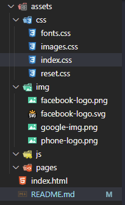
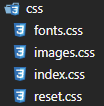

autor: [Hylan Silva](https://github.com/hylansilva) 
data de crição: 07/11/2022 
[Site oficial da plataforma](https://warthena.vercel.app)
# Documentação Warthena Project

Aqui estamos usando HTML5, CSS3 e Js. O projeto é fazer o MVP viavel.

## Índice 

  - [Como ta organizado as pastas e os arquivos:](#como-ta-organizado-as-pastas-e-os-arquivos)
## Como ta organizado as pastas e os arquivos:

eu (Hylan Silva) organizei quase todo o projeto dentro da página de assets, o que deixa mais simples e organizado. o arquivo principal e a página main é o [index.html](index.html)  nele está a página principal que é a página de log-in. 

a parte de Css foi divida em alguns arquivos dentro de uma pasta [Css](./assets/css/) que podem ser bastante importantes no futuro. que no caso são: 
    

### index.css
[index.css](./assets/css/index.css) 
É a parte principal da aplicação, onde o css que normalmente vai ser o criado para harmonizar o projeto, 

### reset.css
[reset.css](./assets/css/reset.css) 
A técnica do reset css é uma forma de suavizar estas diferenças e padronizar a estilização, sobrepondo a formatação original do browsers com uma folha de estilo. Assim, o reset css se tornou um arquivo quase que obrigatório em cada projeto web.

### images.css
[images.css](./assets/css/images.css) 
Neste arquivo aqui vamos estilizar e formatar tudo que é css relacionado as imagens do nosso projeto
### fonts.css
[fonts.css](./assets/css/fonts.css) 
Este arquivo ta separado para podermos separar as fontes da marca e aplicá-la nas organizações do site.

- Em Breve  mais atualizações -